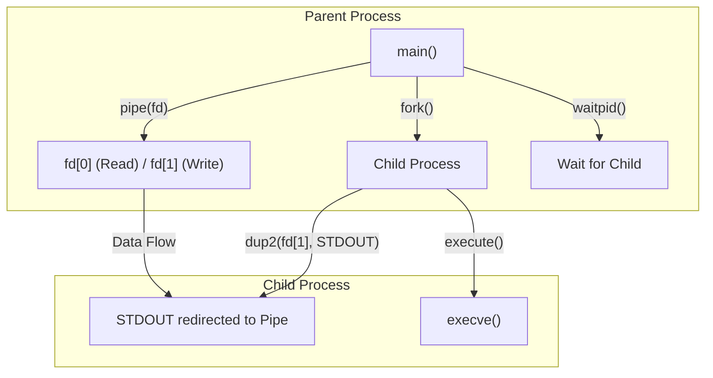

# pipex

A Unix shell pipeline implementation in C that replicates the behavior of shell pipes using system calls like `fork()`, `pipe()`, and `execve()` [1](#2-0) . This project is part of the 42 school curriculum and demonstrates advanced understanding of Unix process management and inter-process communication.

## Table of Contents

- [Overview](#overview)
- [Features](#features)
- [Building](#building)
- [Usage](#usage)
- [Technical Architecture](#technical-architecture)
- [Key Functions](#key-functions)
- [Dependencies](#dependencies)
- [Error Handling](#error-handling)
- [Code Structure](#code-structure)
- [Glossary](#glossary)

## Overview

The `pipex` project recreates shell pipeline functionality by redirecting input through a series of commands to an output file. It simulates the behavior of the shell pipe operator (`|`) using low-level Unix system calls.

## Features

- **Standard Pipeline Mode**: Redirects an input file through commands to an output file
- **Here-Doc Mode**: Reads from `STDIN` until a delimiter is encountered, then processes through commands 
- **Multiple Command Support**: Chains any number of commands together
- **Error Handling**: Comprehensive error checking and reporting
- **42 School Compliance**: Uses only authorized functions and follows coding standards

## Building

### Prerequisites

- GCC compiler
- Make utility
- libft (included as submodule)

### Compilation

```bash
make
```

The build process:
1. Compiles the libft library first 
2. Creates object files in `./tmp/` directory 
3. Links everything together to create the `pipex` executable 

### Additional Make Targets

- `make clean`: Removes object files
- `make fclean`: Removes object files and executable
- `make re`: Performs fclean then all

## Usage

### Standard Pipeline Mode

```bash
./pipex infile cmd1 cmd2 outfile
```

Example:
```bash
./pipex file1.txt "cat" "grep pattern" file2.txt
```

This is equivalent to:
```bash
< file1.txt cmd1 | cmd2 > file2.txt
```

### Here-Doc Mode

```bash
./pipex here_doc LIMITER cmd1 cmd2 outfile
```

Example:
```bash
./pipex here_doc END "cat" "grep pattern" file2.txt
```

*Type your input, then type "END" on a new line to finish*

This is equivalent to:
```bash
cmd1 << LIMITER | cmd2 >> outfile
```

## Technical Architecture

The program orchestrates multiple processes through Unix system calls:

### System Call Flow



### Key System Calls

- **Process Creation**: Uses `fork()` to create child processes 
- **Inter-process Communication**: Establishes pipes with `pipe()`
- **I/O Redirection**: Redirects file descriptors using `dup2()` 
- **Command Execution**: Replaces process images with `execve()` 

## Key Functions

### Core Functions

| Function | Purpose | Location |
| :--- | :--- | :--- |
| `find_path()` | Locates command executables in PATH environment variable | [src/pipex.c:3-32] |
| `execute()` | Executes commands with proper error handling | [src/pipex.c:34-52] |
| `create_process()` | Creates child processes and sets up pipes | [src/pipex.c:54-76] |
| `here_doc()` | Handles here-doc mode input reading | [src/utils.c:17-53] |
| `open_file()` | Opens files with appropriate permissions | [src/pipex.c:78-92] |
| `error_message()` | Displays error messages and exits | [src/utils.c:3-7] |
| `how_to_use()` | Shows usage instructions | [src/utils.c:9-15] |

### Function Details

#### `find_path()`
Searches for the absolute path of a command by parsing the `PATH` environment variable. Uses `ft_split` to separate paths and `access()` to verify file existence.

#### `execute()`
Splits command arguments, finds the executable path, and executes the command using `execve()`. Includes proper memory cleanup and error handling.

#### `create_process()`
The core pipeline function that creates pipes, forks processes, and sets up I/O redirection. Child processes write to the pipe, parent processes read from it.

#### `here_doc()`
Implements the here-doc feature by reading from `STDIN` until a delimiter is found. Uses `get_next_line()` for line-by-line reading.

## Dependencies

### External Libraries

- **libft**: Custom library of C functions (42 school requirement) 
- **ft_printf**: Custom printf implementation for formatted output

### System Headers  
- `fcntl.h`: For file operations (`open()`)
- `unistd.h`: For system calls (`fork()`, `pipe()`, `execve()`, etc.)
- `stdlib.h`: For memory management (`malloc()`, `free()`)
- `stdio.h`: For standard I/O (`perror()`)
- `string.h`: For string operations (`strerror()`)
- `sys/wait.h`: For process waiting (`waitpid()`)

## Error Handling

The program includes comprehensive error handling:

- **File Access Verification**: Checks if files can be opened and accessed
- **Command Path Resolution**: Validates that commands exist in PATH
- **Process Creation Failure**: Handles `fork()` and `pipe()` failures
- **Memory Management**: Proper cleanup of allocated resources
- **User Input Validation**: Ensures correct argument count and format

## Code Structure

```
pipex/
├── Makefile              # Build configuration
├── README.md             # This file
├── headers/
│   ├── pipex.h          # Main header with function prototypes
│   ├── libft.h          # Libft function declarations
│   └── ft_printf.h      # Printf function declarations
├── src/
│   ├── pipex.c          # Main program logic
│   └── utils.c          # Utility functions
└── libft/               # Custom library (submodule)
    ├── src/
    │   └── get_next_line.c
    └── Makefile
```

## Glossary

### Unix System Calls

| Term | Definition |
| :--- | :--- |
| **Pipe** | A unidirectional data channel for interprocess communication |
| **Fork** | Creates a new process by duplicating the calling process |
| **Execve** | Executes a program, replacing the current process image |
| **Dup2** | Duplicates a file descriptor to redirect I/O |
| **Waitpid** | Waits for a specific child process to finish |
| **File Descriptor** | Integer handle for open files or I/O resources |

### Codebase-Specific Terms

- **`here_doc`**: Shell feature for inline input until delimiter
- **`find_path`**: Utility to locate command executables
- **`envp`**: Environment pointer array containing system variables

### 42 School Conventions

- **libft**: Custom library of standard C function implementations
- **get_next_line**: Function to read file descriptors line by line
- **ft_printf**: Custom printf implementation

### Abbreviations

| Abbreviation | Full Term |
| :--- | :--- |
| **AC / AV** | Argument Count / Argument Vector |
| **O_TRUNC** | Open Truncate (clears file contents) |
| **O_APPEND** | Open Append (adds to file end) |
| **F_OK** | File Existence check flag |
| **STDIN_FILENO** | Standard Input (file descriptor 0) |
| **STDOUT_FILENO** | Standard Output (file descriptor 1) |

## Notes

This implementation follows 42 school coding standards and uses only authorized functions. The project demonstrates understanding of:
- Unix process management
- Inter-process communication
- File descriptor manipulation
- Memory management
- Error handling

For more detailed technical information, refer to the [Glossary wiki page](/wiki/stick0789/pipex#5).

## Notes

This README.md provides comprehensive documentation for the pipex project, including build instructions, usage examples, and technical implementation details. The project demonstrates advanced Unix programming concepts including process creation, inter-process communication, and file descriptor manipulation.

Wiki pages you might want to explore:
- [Glossary (stick0789/pipex)](/wiki/stick0789/pipex#5)
